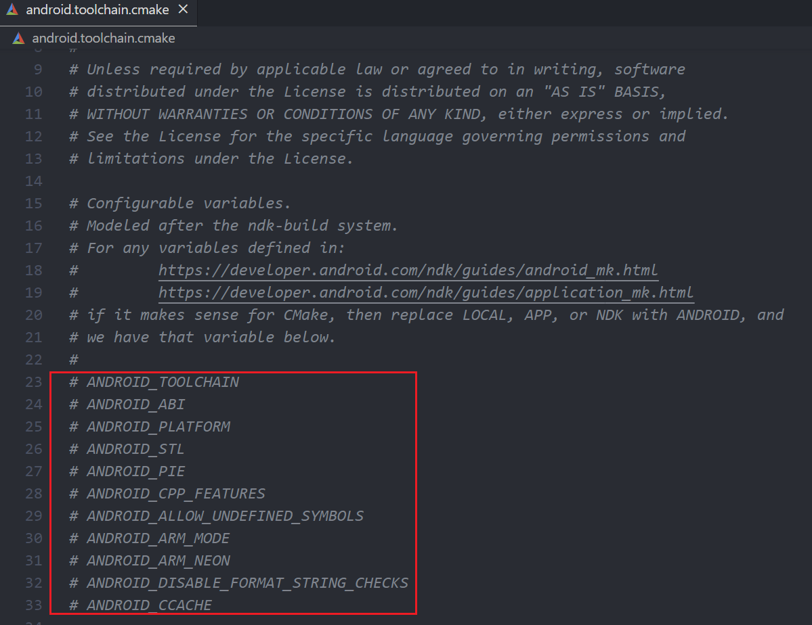
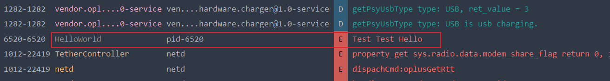

# Cross Compile Android C++ without Android Studio

This guide demonstrates how to build C++ for Android without using Android Studio.

## Basic Compilation

When building with CMake, there are four key considerations:

1. Which generator to use.

Android uses make.exe, located at **ndkpath/prebuilt/windows-x86_64/bin/make.exe**, 
therefore we set CMake generator **Unix Makefiles** and specify **CMAKE_MAKE_PROGRAM** to point to  
the make.exe path.

2. Which compiler to use.

Android uses Clang for compilation. The C compiler is located at **ndkpath/toolchains/llvm/prebuilt/windows-x86_64/bin/clang.exe**, 
and the C++ compiler at **ndkpath/toolchains/llvm/prebuilt/windows-x86_64/bin/clang++.exe**.

However, there is no need to manually set **CMAKE_C_COMPILER** and **CMAKE_CXX_COMPILER**, we set these two
variables through toolchain file, which is located at **ndkpath/build/cmake/android.toolchain.cmake**. 
The CMake variable of toolchain file is **CMAKE_TOOLCHAIN_FILE**, this toolchain file will find all
compilers by itself.

3. Where to find headers.

At **ndkpath/toolchains/llvm/prebuilt/windows-x86_64/sysroot/usr/include/**.

4. Where to find libs.

At **ndkpath/android-ndk-r23c/toolchains/llvm/prebuilt/windows-x86_64/sysroot/usr/lib/aarch64-linux-android/**.

## Android Feature

By passing specific variables to Android toolchain file, we can customize some Android features. 
All available variables we can pass through are listed at the beginning of toolchain file.

The detail of how to pass these variables can be found at https://developer.android.com/ndk/guides/cmake#variables.

## Example

Example in this repo builds an executable file that prints a "hello-world" string to logcat.
In CMakePresets.json, you should change the path of make.exe and toolchain to your local path.
Then build the project, you will get a hello-world executable. Run it using adb, you can see output in logcat.

